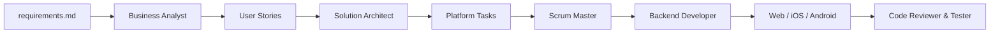

# AGA Agents

A multi-agent playbook for building **multi-platform applications** — with an included **AI-powered B2B lead generation** example domain — across **Backend**, **Web**, **iOS**, and **Android** with consistent standards and a repeatable delivery pipeline.

This repository does not contain application source code. It defines **agent system prompts**, **skills** (standard operating procedures), and **business artifacts** (user stories and platform tasks) that you use with AI assistants (e.g. Cursor, Claude, Gemini) to plan and implement features in separate codebases.

---

## Example product domain

The bundled user stories describe an enterprise **B2B lead generation** platform. Your own `requirements.md` can target any product; the agent workflow stays the same. The reference domain helps clients:

- Onboard and profile their business (website, LinkedIn, optional CRM data)
- Define and refine an Ideal Customer Profile (ICP)
- Discover prospects autonomously via AI-powered web search
- Score opportunities, generate insights, and detect buying signals

User stories in `business/business-analyst/user-stories/` describe this product vision. Agents in `.agent/` encode how each role should interpret and implement those stories on each platform.

---

## How it works

Delivery follows a **requirements → stories → architecture → execution** pipeline. Specialized agents hand off structured artifacts; the Scrum Master coordinates when each platform agent should run.



### Typical workflow

1. **Business Analyst** — Break down `requirements.md` into epics and user stories with BDD acceptance criteria. Output: `business/business-analyst/user-stories/US-*.md`.
2. **Solution Architect** — For each approved story, produce platform-specific technical tasks (strictly scoped to the story). Output: `business/solution-architect/tasks/US-xx/task-{backend,web,android,iOS}.md`.
3. **Scrum Master** — Orchestrate implementation: trigger **Backend** first, wait for API/schema completion, then trigger **Web**, **iOS**, and **Android** in parallel.
4. **Platform agents** — Developers implement tasks using platform skills; testers and code reviewers enforce quality gates before merge.

---

## Repository structure

```
aga-agents/
├── .agent/                          # Agent definitions (prompts + skills)
│   ├── business-analyst/
│   ├── solution-architect/
│   ├── scrum-master/
│   ├── backend/                     # NestJS developer, reviewer, shared skills
│   ├── web/                         # Angular developer, tester, reviewer
│   ├── iOS/                         # Swift developer, tester, reviewer
│   └── android/                     # Kotlin/Compose developer, tester, reviewer
│
└── business/                        # Product & planning artifacts
    ├── business-analyst/
    │   └── user-stories/            # US-01 … US-07
    └── solution-architect/
        └── tasks/                   # Per-story platform task breakdowns
```

### Agent roles

| Role | Path | Responsibility |
|------|------|----------------|
| Business Analyst | `.agent/business-analyst/` | Requirements → user stories |
| Solution Architect | `.agent/solution-architect/` | Stories → cross-platform technical tasks |
| Scrum Master | `.agent/scrum-master/` | Dependency-aware orchestration |
| Backend Developer | `.agent/backend/developer-agent/` | NestJS APIs, data layer, services |
| Web Developer | `.agent/web/developer-agent/` | Angular 21 (signals, standalone) |
| iOS Developer | `.agent/iOS/developer-agent/` | Native iOS implementation |
| Android Developer | `.agent/android/developer-agent/` | Jetpack Compose / MVVM |
| Testers & Reviewers | `*/tester-agent/`, `*/code-reviewer-agent/` | Quality and security gates |

Each agent folder includes an `agent.md` (or `*-agent.md`) system prompt and a `skills/` directory with detailed conventions (architecture, testing, security, CI/CD, etc.).

---

## Getting started

### Prerequisites

- An AI coding assistant (Cursor, Claude Code, Gemini, etc.)
- Separate repositories for backend, web, iOS, and Android application code
- A product `requirements.md` (not included in this repo; supply your own when starting greenfield work)

### 1. Initialize an agent

Open the agent’s main prompt file and paste it into a new conversation, or reference it from your IDE’s agent/rules configuration.

Example — Scrum Master:

```text
.agent/scrum-master/agent.md
```

The agent will reply with an initialization message and ask for the next artifact (requirements, user story, or tasks).

### 2. Run the pipeline for a user story

```text
1. Business Analyst  →  ingest requirements.md  →  write user stories
2. Solution Architect →  ingest US-xx story      →  write task-*.md files
3. Scrum Master       →  ingest US-xx + tasks     →  trigger platform agents
4. Platform devs      →  implement in app repos  →  PR + review + test
```

### 3. Point developers at the right task file

When triggering a platform agent, attach the matching task file, for example:

- `business/solution-architect/tasks/US-01/task-backend.md`
- `business/solution-architect/tasks/US-01/task-web.md`

Platform agents are instructed to read their `skills/` docs **before** writing code.

---

## Included user stories

| ID | Title | Epic |
|----|-------|------|
| US-01 | Client Registration & Intake | Client Onboarding & Profiling |
| US-02 | Client Intake | Client Onboarding & Profiling |
| US-03 | Autonomous Prospect Discovery | Prospect Discovery & Enrichment |
| US-04 | ICP Generation | Client Onboarding & Profiling |
| US-05 | Opportunity Scoring | Intelligence & Prioritization |
| US-06 | Insight Generation | Intelligence & Prioritization |
| US-07 | Signal Detection Engine | Intelligence & Prioritization |

Solution Architect tasks exist for **US-01** under `business/solution-architect/tasks/US-01/`. Additional stories can follow the same folder pattern as they are architected.

---

## Design principles

- **Strict story adherence** — Solution Architect and developers implement only what acceptance criteria specify; no scope creep from inference.
- **Backend-first dependencies** — APIs and schemas land before parallel frontend work.
- **Platform parity with specialization** — Shared workflow, per-platform skills (NestJS, Angular signals, Swift, Compose).
- **Skills as law** — Agents must consult skill documents before implementation or review.
- **Quality gates** — Dedicated tester and code-reviewer agents with checklists for security, performance, and accessibility.

---

## Contributing

Contributions that improve agent prompts, skills, or user stories are welcome.

1. Fork the repository and create a feature branch.
2. Keep changes focused: one agent role or one user story per PR when possible.
3. Align new skills with existing naming and folder conventions under `.agent/`.
4. Open a pull request with a short description of which agent or story you updated and why.

For substantial workflow changes, update both the relevant `skills/*.md` file and this README if the pipeline changes.

---

## About

Maintained by [AGASocial](https://github.com/AGASocial). This project codifies how AI agents collaborate to ship multi-platform products from requirements through implementation.

For questions or access to related application repositories, contact the AGASocial team.
